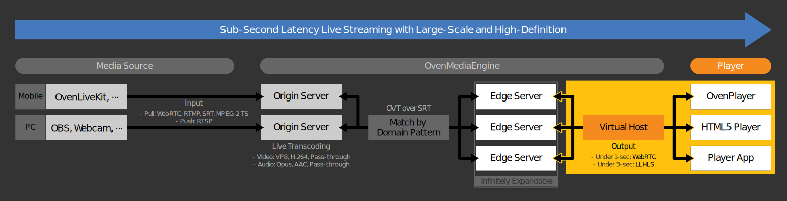

# OvenPlayer

## What is OvenPlayer?


OvenPlayer is a JavaScript-based Player that can play Low Latency HLS (LLHLS) and WebRTC streams optimized for [OvenMediaEngine](https://github.com/AirenSoft/OvenMediaEngine). It provides various APIs, so you can build and operate your media service more easily.

## Demo


OvenSpace is a sub-second latency streaming demo service using [OvenMediaEngine](https://github.com/AirenSoft/OvenMediaEngine), [OvenPlayer](https://github.com/AirenSoft/OvenPlayer) and [OvenLiveKit](https://github.com/AirenSoft/OvenLiveKit-Web). You can experience OvenPlayer in the **[OvenSpace Demo](https://space.ovenplayer.com/)** and see examples of applying in [OvenSpace Repository](https://github.com/AirenSoft/OvenSpace).

## Features
* HTML5 Standard Video Player
* Live Streaming with Various Protocols
    * Sub-Second Latency: WebRTC (Signalling Protocol Conforms to the OME Specification)
    * Low Latency: LLHLS, LLDASH (Chunked CMAF)
    * Legacy: HLS, MPEG-DASH
* Automatic Fallback Streaming
* Fully Customizable UI and SDK
* Insert ADs with Various Formats<
    * VAST4, VAST3, VAST2, VPAID2 (HTML5), VMAP1.0.1
* Support Multiple Subtitle Formats
    * SMI, VTT, SRT

## Quick Start
Please read the [Quick Start](https://airensoft.gitbook.io/ovenplayer/#quick-start).

### OvenPlayer Demo
* Without TLS: http://demo.ovenplayer.com
* With TLS: https://demo.ovenplayer.com

## API and Configuration
Start the [Demo](https://demo.ovenplayer.com) and see [API and Configuration](https://airensoft.gitbook.io/ovenplayer/initialization) for more details.

## Build the source code
Check out [Build](https://airensoft.gitbook.io/ovenplayer/builds) section how to create `ovenplayer.js` for deployment or development after modifying the source code.

## How to contribute
We appreciate your interest in OvenPlayer.

We need your help to keep and develop our open-source project, and we want to tell you that you can contribute in many ways. Please read our [Guidelines](CONTRIBUTING.md), [Rules](CODE_OF_CONDUCT.md), and [Contribute](https://www.ovenmediaengine.com/contribute).

- [Finding Bugs](https://github.com/AirenSoft/OvenPlayer/blob/master/CONTRIBUTING.md#finding-bugs)
- [Reviewing Code](https://github.com/AirenSoft/OvenPlayer/blob/master/CONTRIBUTING.md#reviewing-code)
- [Sharing Ideas](https://github.com/AirenSoft/OvenPlayer/blob/master/CONTRIBUTING.md#sharing-ideas)
- [Testing](https://github.com/AirenSoft/OvenPlayer/blob/master/CONTRIBUTING.md#testing)
- [Improving Documentation](https://github.com/AirenSoft/OvenPlayer/blob/master/CONTRIBUTING.md#improving-documentation)
- [Spreading & Use Cases](https://github.com/AirenSoft/OvenPlayer/blob/master/CONTRIBUTING.md#spreading--use-cases)
- [Recurring Donations](https://github.com/AirenSoft/OvenPlayer/blob/master/CONTRIBUTING.md#recurring-donations)

We always hope that OvenPlayer will make your project a success.

## For more information
* [AirenSoft Website](https://airensoft.com)
  * About OvenMediaEngine, OvenMediaEngine Enterprise, OvenVideo, AirenBlog and more
* [OvenPlayer Getting Started](https://airensoft.gitbook.io/ovenplayer)
  * User guide for OvenPlayer UI Customize, API Reference, Examples, and more
* [OvenMediaEngine GitHub](https://github.com/AirenSoft/OvenMediaEngine)
  * Sub-Second Latency Streaming Server with LLHLS and WebRTC
* [OvenMediaEngine Getting Started](https://airensoft.gitbook.io/ovenmediaengine/)
  * User guide for OvenMediaEngine Configuration, ABR, Clustering, and more
* [OvenLiveKit](https://github.com/AirenSoft/OvenLiveKit-Web)
  * JavaScript-based Live Streaming Encoder for OvenMediaEngine
* [OvenSpace Demo](https://space.ovenplayer.com/)
  * Sub-Second Latency Streaming Demo Service

## License
OvenPlayer is licensed under the [MIT license](LICENSE).

## About AirenSoft
AirenSoft aims to make it easier for you to build a stable broadcasting/streaming service with Sub-Second Latency.
Therefore, we will continue developing and providing the most optimized tools for smooth Sub-Second Latency Streaming.

Would you please click on each link below for details:
* ["JavaScript-based Live Streaming Encoder" **OvenLiveKit**](https://github.com/AirenSoft/OvenLiveKit-Web)
* ["Sub-Second Latency Streaming Server with LLHLS and WebRTC" **OvenMediaEngine**](https://github.com/AirenSoft/OvenMediaEngine)
* ["JavaScript-based Player with LLHLS and WebRTC" **OvenPlayer**](https://github.com/AirenSoft/OvenPlayer)

## How to run this source code

Below are several reliable ways to run and test this repo on Windows (PowerShell). Pick the one that fits your workflow.

### Prerequisites
- Node.js 16+ and npm
- Optional: Docker Desktop (for the Docker/Docker Compose options)

### 1 Quick start (development watch)
This runs webpack in development watch mode and serves files locally so you can iterate quickly.

```powershell
npm install
npm run dev
npx http-server -p 8080
```

Open: http://localhost:8080/demo/demo.html

Notes:
- The demo page loads OvenPlayer from a CDN by default. To test your local build, change the script tag in `demo/demo.html` to use your local bundle:
  - Development build: `/dev/ovenplayer.js`
  - Production build: `/dist/ovenplayer.js`

### 2 Build once for production and serve
Creates a production bundle in `dist/` and serves the repo via a static server.

```powershell
npm install
npm run build
npx http-server -p 8080
```

Open: http://localhost:8080/demo/demo.html

### 3 Direct webpack commands (optional)
Run webpack yourself without npm scripts.

```powershell
# Development (watch -> outputs to ./dev)
npx webpack --config webpack.development.js --watch

# Production (single build -> outputs to ./dist)
npx webpack --config webpack.config.js
```

### 4 Docker: production image (nginx)
Build and run a production container that serves `dist`, `demo`, and assets via nginx.

```powershell
docker build -t ovenplayer:local .
docker run --rm -p 8080:80 ovenplayer:local
```

Open: http://localhost:8080/ (auto-redirects to `/demo/demo.html`)

### 5 Docker Compose profiles
- Development (webpack watch + static nginx):

```powershell
docker compose --profile development up --build
```

Open: http://localhost:8082/demo/demo.html

- Production (prebuilt image from Docker Hub):

```powershell
docker compose --profile production up -d
```

Open: http://localhost/

### 6 Framework demo packages (optional)
Run the React and Vue 3 demo packages in `packages/` with Vite.

```powershell
# React
cd packages/react
npm install
npm run dev

# Vue 3 (in a new terminal or after stopping React)
cd ../../packages/vue3
npm install
npm run dev
```

Open the URL printed by Vite (e.g., http://localhost:5173).

### Troubleshooting
- Port already in use: change `-p 8080` to another port (e.g., `-p 8081`).
- "Missing script: dev": ensure your root `package.json` has a `dev` script that runs the webpack watch (e.g., `npm run watch`). You can also use `npx webpack --config webpack.development.js --watch` directly.
- Windows path or permission issues with Docker volumes: ensure file sharing is enabled for the drive in Docker Desktop settings.
